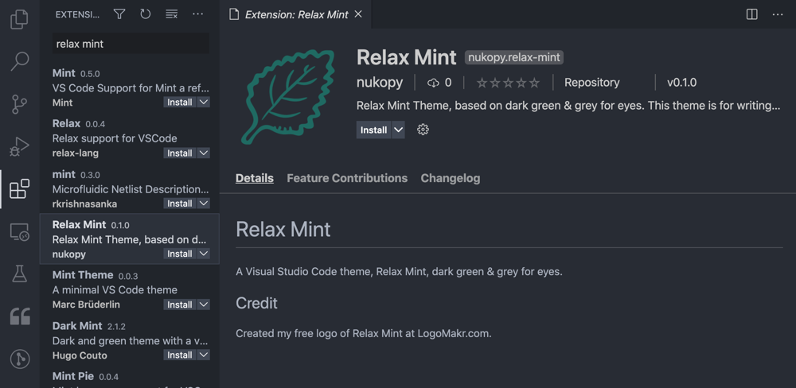
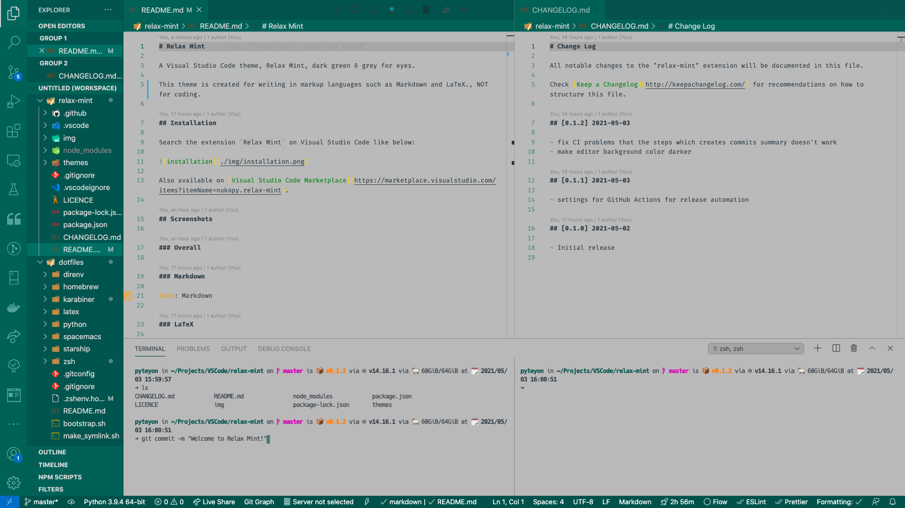
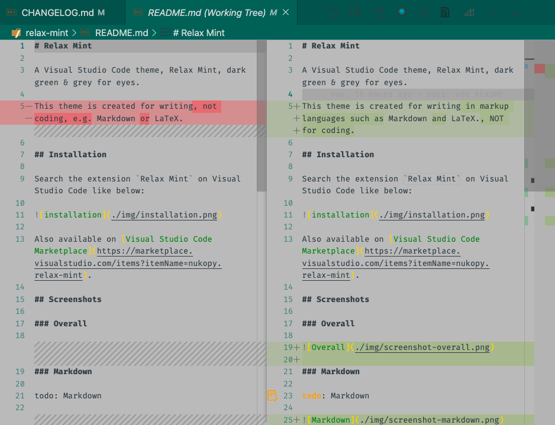

# Relax Mint

    

A Visual Studio Code theme, Relax Mint, dark green & grey for eyes.

This theme is created for writing in markup languages such as Markdown and LaTeX., NOT for coding.

## Installation

Search the extension `Relax Mint` on Visual Studio Code like below:

Also available on [Visual Studio Code Marketplace](https://marketplace.visualstudio.com/items?itemName=nukopy.relax-mint).

## Screenshots

### Overall

### Markdown

todo: Markdown

### LaTeX

todo: LaTeX

### Git Diff

## CHANGELOG

- [CHANGELOG.md](https://github.com/nukopy/relax-mint-vscode-theme/blob/master/CHANGELOG.md)

## Credit

Created my free logo of Relax Mint at [LogoMakr.com](https://logomakr.com/).
